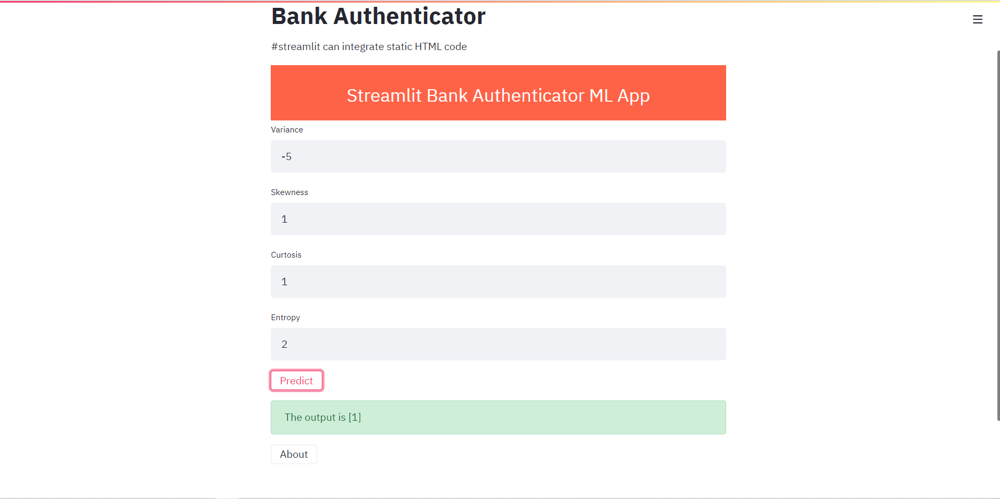

# Bank-Note-Authentication
Bank Note Authentication website based on Random Forest Classifier, Streamlit and HTML

## Motivation
This website aims to detect fraudulent notes accurately. For that, a set of images taken from genuine and forged banknote-like specimens is created.
Features such as wavelet variance, wavelet skewness, wavelet kurtosis, and image entropy are extracted from the images.

## Features

1️⃣ Interactive website 

2️⃣ UCI Bank Note authentication dataset

3️⃣ Detect fraudulent notes using image features

4️⃣ Streamlit (in-built HTML) used to build basic website

5️⃣ Random Forest Classification 

## How to use?
Data were extracted from images that were taken from genuine and forged banknote-like specimens. 

Run streamlit run streamlit_app.py command in cmd after downloading codes which will redirect you to the website at 127.0.0.1:8000/apidocs

## Contribute 👨‍👨‍👧‍👦
Thanks for taking the time to contribute!

The following is a set of guidelines for contributing to Bank Note Authentication. These are just guidelines, not rules, so use your best judgement and feel free to propose changes to this document in a pull request.

If you have any questions, open an issue.

### Issue 

Ensure the bug was not already reported by searching on GitHub under issues. If you're unable to find an open issue addressing the bug, open a new issue.

Write detailed information. Detailed information is very helpful to understand an issue.

For example: How to reproduce the issue, step-by-step. The expected behavior (or what is wrong). Screenshots for issues. The operating system.

### Pull Requests

Pull Requests are always welcome.
